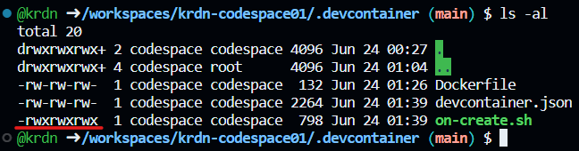

# krdn-codespace01

아래를 기반으로 학습됨.

https://github.com/microsoft/light-up-azure/tree/main/09-gh-codespaces-copilot


### 추가 설치 

```bash
dotnet new gitignore
```

.devcontainer 폴더 생성


### 파일 3개 추가

 Dockerfile, devcontainer.json, on-create.sh 


### on-create.sh 실행 파일로 변경 

```bash
chmod +x ./on-create.sh
```




